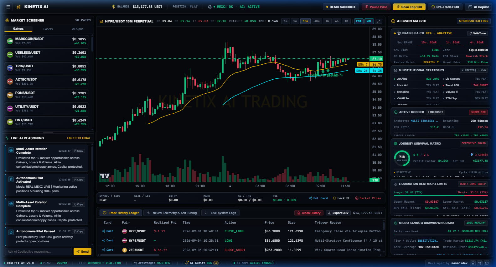
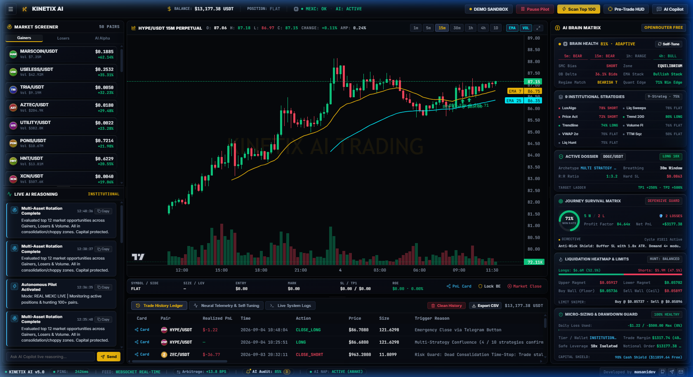
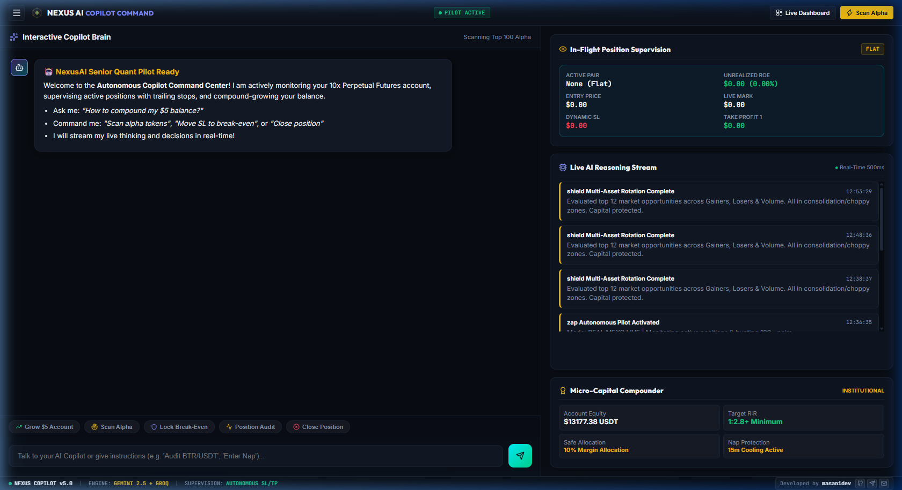

<div align="center">

# ⚡ KINETIX AI TRADING TERMINAL
### Autonomous Institutional Crypto Perpetual Futures Engine & Multi-Agent Quant Tournament

[](#early-access--waitlist)
[](#-the-10-independent-quantitative-desks)
[](https://t.me/masanidev)
[](mailto:masanideveloper@gmail.com)
[](https://github.com/masanideveloper)

<br />

**Kinetix AI** is a next-generation autonomous crypto trading terminal designed for institutional-grade market structure analysis, continuous multi-asset scanning, real-time strategy tournaments, and asymmetric capital compounding.

Built from the ground up for high-precision algorithmic execution on **MEXC Perpetual Futures** and **Binance Futures**.

[Request Early Access](#early-access--waitlist) · [Live Dashboard](#-interface-showcase) · [Quantitative Desks](#-the-10-independent-quantitative-desks) · [Roadmap](#-release-roadmap)

<br />

---

### 🖥️ High-Frequency Autonomous Terminal Interface


</div>

---

## ⚡ The Institutional Edge: Why Kinetix AI?

95% of retail crypto trading bots fail because they rely on single-indicator signals (like basic RSI or MACD crossovers), trade indiscriminately during choppy dead-zones, and incur catastrophic fee bleed.

**Kinetix AI operates like a quantitative hedge fund desk:**

```
                                 TOP 100 PERPETUAL FUTURES PAIRS
                   (15m/1h Candlestick Orderflow, Real-Time Bid/Ask L2 Depth Delta)
                                                │
                                                ▼
                   ┌────────────────────────────────────────────────────────────┐
                   │          10 INDEPENDENT QUANTITATIVE DESKS                 │
                   │   SMC · ICT · Fibonacci OTE · Price Action · Trend 200     │
                   │   Volume Flow · Liquidity Sweeps · VWAP · TTM Squeeze      │
                   └────────────────────────────┬───────────────────────────────┘
                                                │
                                                ▼
                   ┌────────────────────────────────────────────────────────────┐
                   │       HIGH-SPEED WALK-FORWARD TOURNAMENT & VECTORBT        │
                   │   • Backtests candidates across historical candle windows  │
                   │   • Strict Invalidation: Rejects setups with <50% Win Rate │
                   │   • Identifies the #1 Champion Strategy Archetype          │
                   └────────────────────────────┬───────────────────────────────┘
                                                │
                                                ▼
                   ┌────────────────────────────────────────────────────────────┐
                   │            MULTI-AGENT NEURAL SUPERVISORY COUNCIL          │
                   │   • Google Gemini 2.5 Flash · Groq Cloud · DeepSeek        │
                   │   • Macro HTF Trend Confirmation (1h / 4h Alignment)       │
                   │   • Chaikin / Volatility Regime Filter (CHOP > 60 Skipped) │
                   └────────────────────────────┬───────────────────────────────┘
                                                │
                                                ▼
                   ┌────────────────────────────────────────────────────────────┐
                   │             PRECISION LIMIT EXECUTION & RISK GUARD         │
                   │   • Dynamic Quarter-Kelly Micro-Position Sizing            │
                   │   • Structural Invalidation Stop-Loss & Multi-Tier TP      │
                   │   • Real-Time Instant Telegram Briefings & Remote Control  │
                   └────────────────────────────────────────────────────────────┘
```

---

## 📸 Interface Showcase

### 1. High-Density Trading Terminal
Real-time TradingView candlestick visual engine with dynamic institutional order lines, real-time unspent liquidity heatmaps, multi-pair screener, and live trade telemetry.
<div align="center">
  
</div>

### 2. Autonomous Neural Telemetry & Self-Tuning Brain
Self-learning neural matrix monitoring health scores, win rates, drawdown buffers, and live strategy allocations.
<div align="center">
  
</div>

### 3. Interactive Copilot Command Center
Direct natural language command center and position supervision interface allowing real-time thesis auditing, dynamic risk dialing, and 1-click execution.
<div align="center">
  
</div>

---

## 🏛️ The 10 Independent Quantitative Desks

Every single token scan runs through our 10 autonomous quantitative modules. When an opportunity is detected, the lead strategy anchors mathematically defined invalidations:

| # | Quantitative Desk | Methodology | Mathematical Invalidation Anchor |
| :- | :--- | :--- | :--- |
| **1** | **LuxAlgo Smart Money Concepts (SMC)** | Market Structure Shifts (BOS / CHoCH), Order Blocks, Fair Value Gaps (FVG). | Closed 15m candle beyond structural Order Block boundary. |
| **2** | **ICT Liquidity Sweeps** | Buy-Side & Sell-Side Liquidity sweeps (BSL/SSL), Turtle Soup manipulation wicks. | Hard stop tucked behind the swept liquidity rejection wick. |
| **3** | **Pure Price Action** | Key horizontal S/R flips, institutional pinbars, hammers, and engulfing bars. | Invalidation anchored at rejection pinbar extreme. |
| **4** | **Systematic Trend Following** | Macro 200 EMA trend filtering + 20/50 EMA ribbon dynamic pullbacks. | 1.5x ATR trailing band anchored behind 50 EMA. |
| **5** | **Fibonacci Golden Pocket & ICT OTE** | High-precision 0.618 Golden Pocket & 0.705 Optimal Trade Entry retracements. | Anchored strictly behind the 0.786 / 0.886 deep defense level. |
| **6** | **Institutional Volume Flow & Depth** | Real-time L2 orderbook wall dominance (>58% ratio) and volume surges. | Anchored behind high-density limit bid/ask liquidity walls. |
| **7** | **Session VWAP Mean Reversion** | Volume-Weighted Average Price with $2\sigma$ statistical expansion bands. | Reversal stop outside the $2.5\sigma$ statistical standard deviation band. |
| **8** | **TTM Volatility Squeeze** | Bollinger Bands compressing inside Keltner Channels + explosive directional release. | Anchored behind the pre-breakout compression base. |
| **9** | **Trendline Breakout & Channel Retests** | Dynamic diagonal channel bounces, diagonal breaks, and structural retests. | Anchored behind dynamic diagonal support/resistance rays. |
| **10** | **Retail Liquidation Hunting** | Liquidation heatmap cluster targeting, funding rate skews, and cascade reversals. | Anchored beyond the cleared liquidation magnet pool. |

---

## 🛡️ Execution Engine & Institutional Risk Guard

- **Sub-Second Precision Limit Retests**: Rather than chasing green candles with market orders, Kinetix AI places limit retest bids at structural demand blocks to minimize slippage and fees.
- **Dynamic Quarter-Kelly Sizing**: Automatically scales position sizes based on real-time account tiers ($5–$25 micro-sniper up to institutional whale tiers).
- **Daily Drawdown Circuit Breaker**: Hard safety ceiling that automatically pauses scanning if daily loss limits are touched, preserving capital.
- **Bi-Directional Telegram Remote Control**: Complete real-time trade briefings dispatched instantly with inline interactive buttons to lock break-even or trigger emergency exits from anywhere in the world.

---

## 🗺️ Release Roadmap

- [x] **Core Institutional Engine**: 10 Quantitative Strategy Desks + Fast Walk-Forward Tournament.
- [x] **Trading Terminal GUI**: Real-time TradingView charts, multi-pair screener, and orderbook telemetry.
- [x] **Telegram Integration**: Institutional trade briefing cards & interactive remote management.
- [ ] **Phase 1: Private Alpha (Current)**: Closed invite-only paper & live beta testing with early waitlist members.
- [ ] **Phase 2: Multi-Exchange Expansion**: Seamless concurrent multi-account routing across Bybit, OKX, and Binance.
- [ ] **Phase 3: Public Release**: One-click desktop installer (Windows / macOS / Linux) and hosted cloud instances.

---

## 🎟️ Early Access & Waitlist

We are currently onboarding our first cohort of private alpha traders, quantitative researchers, and VIP testers.

To request private access, inquire about early testing, or discuss institutional deployment:

- 💬 **Telegram**: [@masanidev](https://t.me/masanidev)
- ✉️ **Inquiries & Email**: [masanideveloper@gmail.com](mailto:masanideveloper@gmail.com)
- 🐙 **GitHub Developer**: [@masanideveloper](https://github.com/masanideveloper)
- ⭐ **Star this repository** to track upcoming alpha drops and public releases!

---

### ⚠️ Disclaimer
*Kinetix AI is institutional algorithmic trading software engineered for educational and quantitative research purposes. Cryptocurrency futures trading involves substantial risk of loss. Past backtested performance does not guarantee future financial results. Always practice strict risk management.*

<div align="center">
  <sub>Designed & Engineered with Precision · © 2026 Kinetix AI Systems. All rights reserved.</sub>
</div>